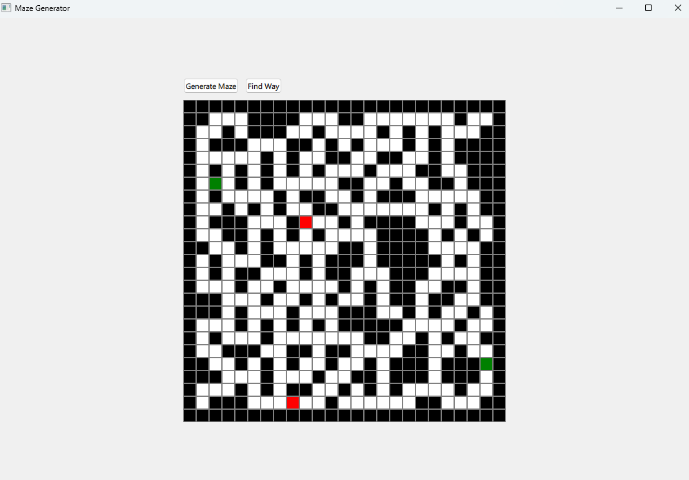
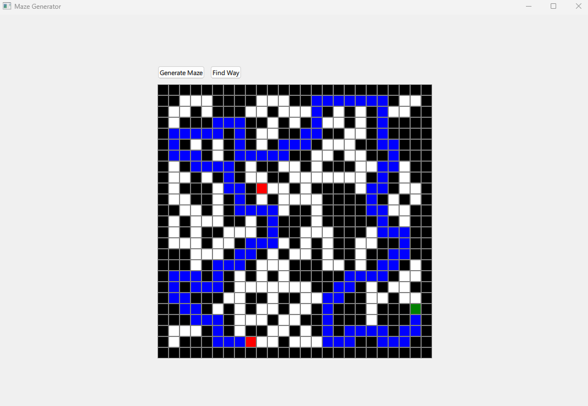

# Labyrinth
The task is to create a random maze and save it. A maze solver can then load the maze and search for a way from S to E. 
A created maze will look like this

## Create Maze
W W W W W W W W W W W W W W W W W W W W 
W W W W X X X W X X X W X X X X X X X W 
W W W W X W X X X W X W X W X W X W X W 
W W W W X X W X W X X W X W X X X X X W 
W W W W W X W X W W X X X X W X W W X W 
W W W W W X X X W W X W W X X X X X X W 
W W W W X X W X W W X X X W W X W W X W 
W W X X X W X X X W X W X W W X X X X W 
W X X W X W X W E X X W X X X W X W X W 
W X W X X W X X W W X X X W X W S X X W 
W X X X W X X W X X X W W X X X W W X W 
W W W X X X W X W W X X X X W X W W X W 
W W W W W X X X X X X W W X W X W W X W 
W W W W W X W W X W W W X X X X W W X W 
W W W W W X X X X X X X X W W X X W X W 
W W W W W X W W X W W X W W W W X X X W 
W W W W W X W W X X X X W W X X X W X W 
W W W W W X W X X W W X X W X W X W X W 
W W W W W X X X W W W W X X X X X X X W 
W W W W W W W W W W W W W W W W W W W W

It is a 20x20 maze where 'W' = wall, 'X' = path, 'S'=start and 'E'=end

## Find Path in Maze
W W W W W W W W W W W W W W W W W W W W 
W W O O O W X X W W W W X X W X X X W W 
W O O W O O W X X X W W X W X X W X X W 
W O W W W O O W W X W X X W X W W W X W 
W O W W X W O O W O O O W W X X X W X W 
W O O O X W W O W O W O O O X W X W X W 
W X W O W W W O O O W X W O W X W X X W 
W O O O W W W X W W W X W O W X X X W W 
W O W W W W W X X X W X X O O W W X W W 
W O O W W W X X W X X W X W O W X X X W 
W W O O O W X W W W X W W O O W X W X W 
W W W W O O W W W W X W X E W X X W X W 
W W W W W O O W W X X X X W W W X X X W 
W W W W W W O W X X W W X W W W W X W W 
W W W W W W O O W X W W W W W W X X X W 
W W W W W W W O O O W W W W W X X W X W 
W W W W W W X X W O O S W W W X W X X W 
W W W W W W X W X W W X X W X X X W X W 
W W W W W W X X X W W W X X X W X X X W 
W W W W W W W W W W W W W W W W W W W W

Search for a 20x20 maze all chars have the same meaning 'O'means found path

## Issues 
- It can hapens that no maze is created because of a stackoverflow 
- The finding of a solution is slow a other container might help. 

## GUI 
A GUI is added with Qt. The maze is shown in a grid. The user can create a maze and solve it.

This image show a generate maze by clicking on the button 'Generate Maze':

This image show a solved maze by clicking on the button 'Solve Maze':

